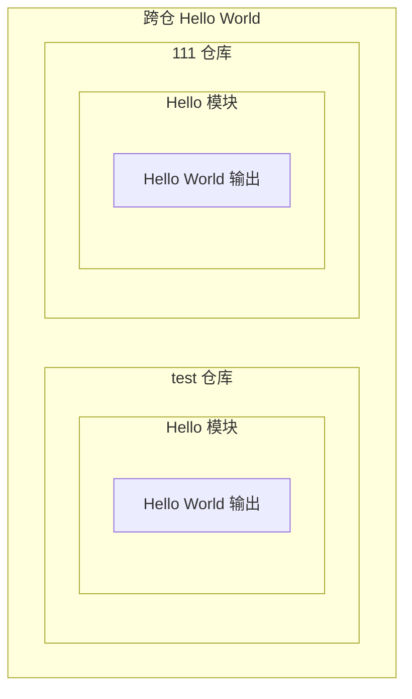
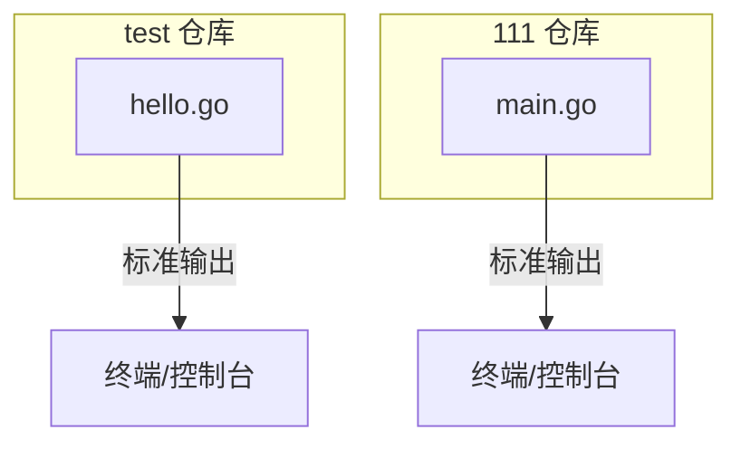
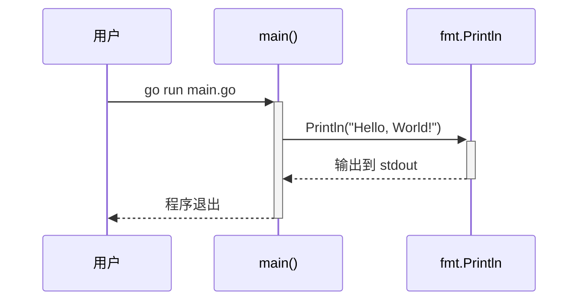

> **文档元信息**
>
> | 项目 | 内容 |
> |------|------|
> | 文档版本 | v1.1 |
> | 作者 | DTCoder |
> | 创建日期 | 2026-08-18 |
> | 需求来源 | 用户人工输入 |
> | 评审状态 | 待评审 |

# 跨仓 Hello World 系分设计

## 1. 需求与范围

### 背景与目标

用户需要在两个协作仓库（test 仓库 和 111 仓库）中分别添加一个 Hello World 程序。该需求旨在验证跨仓开发流程的基础能力，同时为各仓库引入最基本的可运行入口。

### 核心功能

- 在 test 仓库中新增一个 Hello World 程序，输出 "Hello, World!" 到标准输出
- 在 111 仓库中新增一个 Hello World 程序，输出 "Hello, World!" 到标准输出

### 约束与非功能要求

- 不引入外部依赖，仅使用语言标准库
- 程序应可独立运行，无复杂构建流程
- 代码风格与各自仓库已有代码保持一致

### 排除范围

- 不涉及 CI/CD 流水线配置
- 不涉及单元测试编写
- 不涉及日志、监控、权限等非功能性设计

### 需求功能清单与优先级

| 编号 | 功能点 | 优先级 | PRD 原始描述/章节 | 备注 |
|------|--------|--------|-------------------|------|
| F01 | test 仓库 Hello World 程序 | P0 | "帮我在这两个仓库分别都写个hello world" | Go 语言实现 |
| F02 | 111 仓库 Hello World 程序 | P0 | "帮我在这两个仓库分别都写个hello world" | 假设：采用 Go 语言，与 test 仓库保持一致 |

### 假设与待确认项

| 编号 | 假设/待确认内容 | 当前假设 | 确认状态 |
|------|-----------------|----------|----------|
| A01 | 111 仓库的编程语言选择 | 假设：采用 Go 语言，与 test 仓库技术栈保持一致 | 待确认 |
| A02 | Hello World 输出内容 | 假设：标准 "Hello, World!" 字符串 | 已确认 |
| A03 | 文件命名 | 假设：test 仓库使用 `hello.go`，111 仓库使用 `main.go` | 已确认 |

## 2. 架构与模块

### 功能架构



- test 仓库：在已有 Go 项目（`package main`）中新增 `hello.go`，提供独立的 Hello World 入口
- 111 仓库：新建 `main.go`，作为 Go 项目的 Hello World 入口

**模块清单**

| 模块 | 职责 | 依赖 |
|------|------|------|
| test 仓库 - Hello 模块 | 输出 "Hello, World!" 到标准输出 | Go 标准库 `fmt` |
| 111 仓库 - Hello 模块 | 输出 "Hello, World!" 到标准输出 | Go 标准库 `fmt` |

### 应用集成架构

本需求为两个独立仓库各自新增一个本地可执行程序，无外部系统集成、无网络调用、无中间件依赖。



**集成关系说明：**

| 调用方 | 被调用方 | 协议 | 接口类型 | 说明 |
|--------|----------|------|----------|------|
| test 仓库 hello.go | Go fmt 标准库 | 进程内调用 | 标准库函数 | 输出文本到 stdout |
| 111 仓库 main.go | Go fmt 标准库 | 进程内调用 | 标准库函数 | 输出文本到 stdout |

### 部署架构

本需求为本地可执行程序，无需服务化部署。

- **运行方式**：通过 `go run` 或编译后直接执行
- **无负载均衡、无数据库、无外部存储依赖**
- 本项不适用：无服务化部署需求，原因：Hello World 为本地工具程序

## 3. 数据模型与存储

本需求不涉及数据持久化、数据库表设计或缓存。

- 实体清单：无
- 实体关系图：本项不适用，原因：Hello World 程序无业务实体

## 4. 接口设计

本需求为本地命令行程序，无网络接口。

### 4.1 oneapi（Web 控制台接口）

本项不适用，原因：无 Web 服务。

### 4.2 OpenAPI（对外接口）

本项不适用，原因：无对外 API 服务。

### 4.3 内部接口（Service 层）

本项不适用，原因：无服务层，程序为单文件直接执行。

### 4.4 集成接口（Integration 层）

本项不适用，原因：无外部系统集成。

### 4.5 CLI 命令行接口文档

本需求为本地命令行程序，接口形式为 CLI（命令行接口）。以下分别描述两个仓库的程序接口契约。

#### 4.5.1 test 仓库 - hello.go 接口

| 项目 | 说明 |
|------|------|
| 程序文件 | `hello.go` |
| 包名 | `main` |
| 入口函数 | `main()` |
| 运行方式 | `go run hello.go` 或编译后执行 `./hello` |
| 命令行参数 | 无 |
| 标准输入 | 不读取 |
| 标准输出 | `Hello, World!\n` |
| 标准错误 | 无预期输出 |
| 退出码 | `0`（成功） |

**执行示例：**

```bash
$ go run hello.go
Hello, World!
```

**编译执行示例：**

```bash
$ go build -o hello hello.go
$ ./hello
Hello, World!
$ echo $?
0
```

---

#### 4.5.2 111 仓库 - main.go 接口

| 项目 | 说明 |
|------|------|
| 程序文件 | `main.go` |
| 包名 | `main` |
| 入口函数 | `main()` |
| 运行方式 | `go run main.go` 或编译后执行 `./main` |
| 命令行参数 | 无 |
| 标准输入 | 不读取 |
| 标准输出 | `Hello, World!\n` |
| 标准错误 | 无预期输出 |
| 退出码 | `0`（成功） |

**执行示例：**

```bash
$ go run main.go
Hello, World!
```

**编译执行示例：**

```bash
$ go build -o main main.go
$ ./main
Hello, World!
$ echo $?
0
```

---

#### 4.5.3 接口契约汇总

| 仓库 | 文件 | 输入 | 输出 | 退出码 |
|------|------|------|------|--------|
| test | `hello.go` | 无 CLI 参数，无 stdin | stdout: `Hello, World!` | 0 |
| 111 | `main.go` | 无 CLI 参数，无 stdin | stdout: `Hello, World!` | 0 |

**错误处理：**

| 错误场景 | 行为 |
|----------|------|
| Go 运行时未安装 | Shell 返回非零退出码，提示 `go: command not found` |
| 标准输出被重定向到不可写路径 | 运行时 panic，退出码非零 |
| 传入未知命令行参数 | 忽略，程序正常执行并输出 `Hello, World!` |

## 5. 功能模块设计

### 5.1 test 仓库 - Hello 模块

#### 5.1.1 表结构设计

本项不适用，原因：Hello World 程序无数据持久化需求。

##### 枚举与常量定义

本模块无枚举/常量定义。

#### 5.1.2 接口详细设计

本项不适用，原因：本地程序，无网络接口。程序入口为 `main()` 函数。

#### 5.1.3 子功能详细设计

##### 5.1.3.1 Hello World 输出（F01）

- 处理时序图


**业务规则：**

| 规则编号 | 规则描述 | 校验时机 | 不满足时的处理 |
|----------|----------|----------|----------------|
| R01 | 程序启动后立即输出 "Hello, World!" 并正常退出 | 运行时 | N/A |

**异常场景：**

| 异常场景 | 处理方式 |
|----------|----------|
| 标准输出不可用 | 由操作系统/运行时处理，程序返回非零退出码 |

**并发控制：** 无并发风险，原因：单线程顺序执行，无共享状态。

---

### 5.2 111 仓库 - Hello 模块

#### 5.2.1 表结构设计

本项不适用，原因：Hello World 程序无数据持久化需求。

##### 枚举与常量定义

本模块无枚举/常量定义。

#### 5.2.2 接口详细设计

本项不适用，原因：本地程序，无网络接口。程序入口为 `main()` 函数。

#### 5.2.3 子功能详细设计

##### 5.2.3.1 Hello World 输出（F02）

- 处理时序图



**业务规则：**

| 规则编号 | 规则描述 | 校验时机 | 不满足时的处理 |
|----------|----------|----------|----------------|
| R01 | 程序启动后立即输出 "Hello, World!" 并正常退出 | 运行时 | N/A |

**异常场景：**

| 异常场景 | 处理方式 |
|----------|----------|
| 标准输出不可用 | 由操作系统/运行时处理，程序返回非零退出码 |

**并发控制：** 无并发风险，原因：单线程顺序执行，无共享状态。

## 6. 非功能性需求设计

### 6.1 高可用性

本项不适用，原因：Hello World 为本地单次执行程序，无服务可用性要求。

### 6.2 可扩展性

本项不适用，原因：程序功能单一，无扩展需求。

### 6.3 稳定性/可靠性

程序行为确定：固定输出 "Hello, World!" 后退出。在正常操作系统环境下运行结果稳定可靠。

### 6.4 安全性设计

#### 6.4.1 账户系统方案

本项不适用，原因：无用户认证需求。

#### 6.4.2 授权&访问控制

##### 6.4.2.1 是否实现水平权限检查

本项不适用，原因：无多租户/多用户场景。

##### 6.4.2.2 是否实现垂直权限检查

本项不适用，原因：无角色权限需求。

##### 6.4.2.3 是否检查登录态

本项不适用，原因：本地程序，无登录态概念。

#### 6.4.3 数据防护方案

##### 6.4.3.1 是否对敏感数据加密存储

本项不适用，原因：无敏感数据存储。

##### 6.4.3.2 是否对敏感数据展示进行脱敏

本项不适用，原因：输出内容为固定字符串 "Hello, World!"，无敏感信息。

### 6.5 监控/统计/日志/告警

本项不适用，原因：本地单次执行程序，无持续运行监控需求。

## 7. 变更三板斧

### 7.1 可监控

本项不适用，原因：程序为一次性执行，无持续运行指标需要监控。可通过退出码（0=成功，非0=失败）判断执行结果。

### 7.2 可灰度

本项不适用，原因：Hello World 为全新功能新增，无旧版本逻辑需要灰度切换。

### 7.3 可应急

本项不适用，原因：程序逻辑极简，无开关/降级需求。如需回退，直接删除新增文件即可，无上下游兼容性风险。
